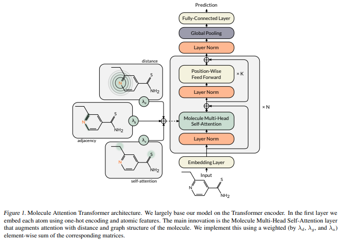

</img>

## Molecule Attention Transformer - Pytorch (wip)

Pytorch reimplementation of <a href="https://arxiv.org/abs/2002.08264">Molecule Attention Transformer</a>, which uses a slightly modified transformer to tackle the graph-like structure of molecules. The repository is also meant to be educational, to understand the limitations of transformers for 
processing graphs (or perhaps lack thereof).

## Install

```bash
$ pip install molecule-attention-transformer
```

## Usage

```python
import torch
from molecule_attention_transformer import MAT

model = MAT(
    dim_in = 26,
    model_dim = 512,
    dim_out = 1,
    depth = 6
)

atoms           = torch.randn(2, 100, 26)
mask            = torch.ones(2, 100).bool()
adjacency_mat   = torch.empty(2, 100, 100).random_(2).float()
distance_mat    = torch.randn(2, 100, 100)

out = model(
    atoms,
    mask = mask,
    adjacency_mat = adjacency_mat,
    distance_mat = distance_mat
) # (2, 1)
```

## Citations

```bibtex
@misc{maziarka2020molecule,
    title={Molecule Attention Transformer}, 
    author={Łukasz Maziarka and Tomasz Danel and Sławomir Mucha and Krzysztof Rataj and Jacek Tabor and Stanisław Jastrzębski},
    year={2020},
    eprint={2002.08264},
    archivePrefix={arXiv},
    primaryClass={cs.LG}
}
```
